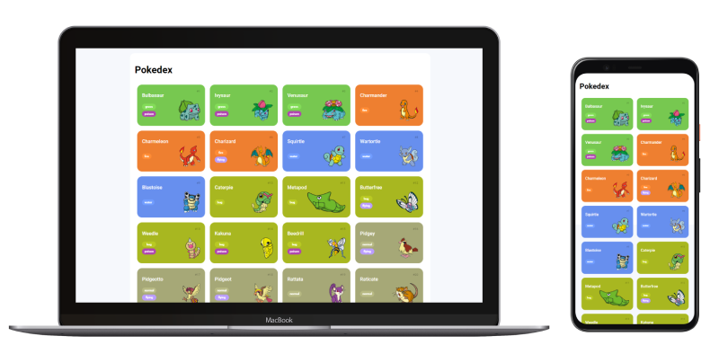

# Entrega de projeto - Construindo uma Pokédex com JavaScript | DIO
Bem-vindo ao repositório da Pokédex Incrível! Este projeto foi desenvolvido como parte dos Desafios de Projeto da DIO, onde você não só entenderá a importância do Git/GitHub, mas também explorará o mundo fascinante dos Pokémon através do consumo de uma API REST.

### Tecnologias Utilizadas
- JavaScript: A linguagem principal utilizada para manipulação de dados e interação com a API.
- HTML/CSS: Estrutura e estilo da Pokédex.
- Git/GitHub: Controle de versão e colaboração.
- API REST de Pokémon: Fonte dos dados dos Pokémon.

### Funcionalidades da Pokédex
- Busca de Pokémon: Pesquise por diferentes Pokémon pelo nome ou ID.
- Detalhes do Pokémon: Veja informações detalhadas sobre cada Pokémon, incluindo tipo, habilidades e estatísticas.
- Interface Interativa: Navegação fácil e intuitiva através de uma interface web atraente.

### Veja o projeto
[Link do projeto](https://fabiocasadossites.github.io/desafio-js-1-dio/)
